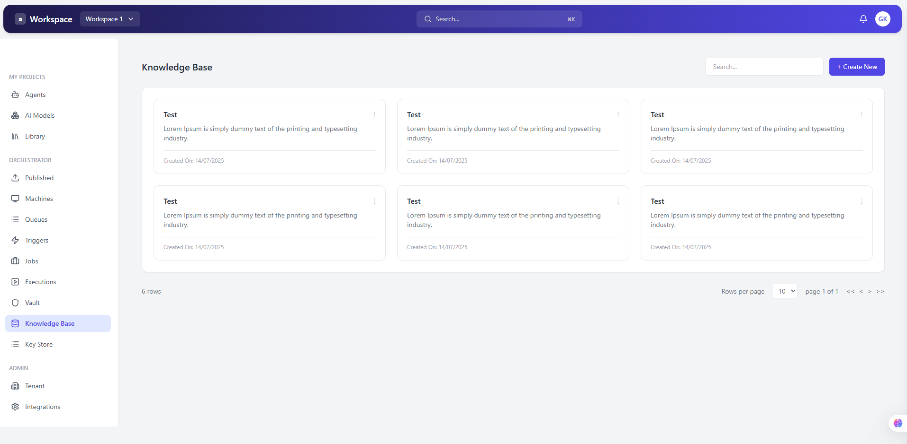
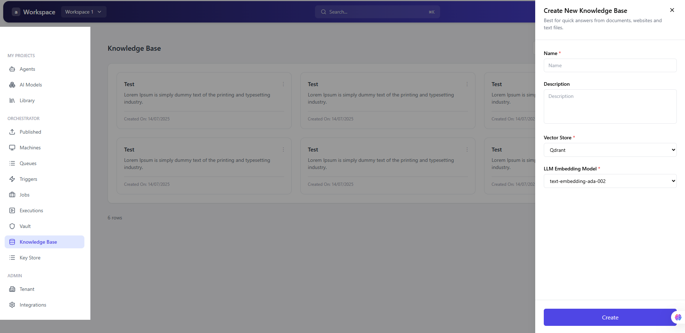
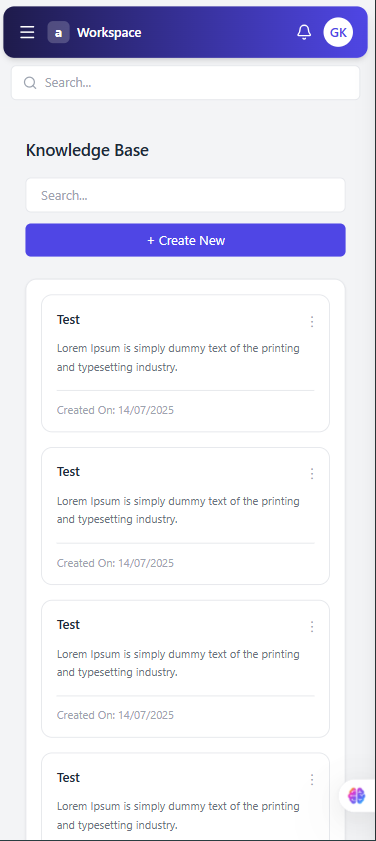
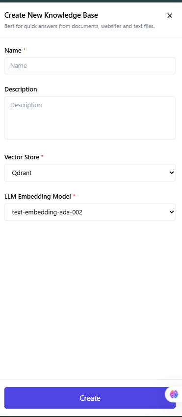

# Knowledge Base UI

## Overview
This project is a frontend UI I built based on a Figma design. The goal was to recreate the layout as closely as possible while keeping the code clean and responsive.

It includes a dashboard-style interface with a sidebar, header, card layout, and a modal for creating a new knowledge base.

---

## Tech Stack
- React (functional components + hooks)
- Tailwind CSS
- Lucide Icons

---

## Features
- Clean sidebar navigation
- Fully responsive layout (works on mobile, tablet, desktop)
- Card-based UI for displaying items
- Slide-in modal (drawer) for creating new entries
- Basic search input UI
- Reusable components (Card, Modal, Sidebar, Header)

---

## 📸 Screenshots

## 📸 Screenshots

### Home Page

### Modal

### Mobile View

## Live Demo
(Live link will be added here)
